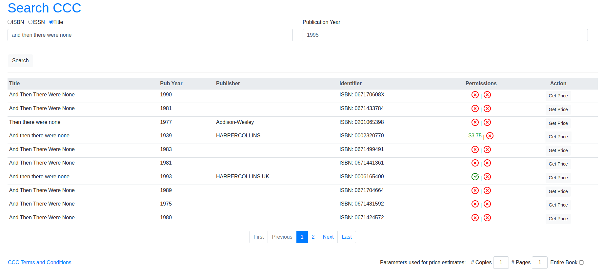

# CCC's Copyright Permissions Service API Integration

CCC (Copyright Clearance Center) is a not-for-profit corporation that provides permissions to reuse text-based copyrighted content from thousands of leading publishers in academic course content such as course packs, e-reserves, and LMS postings.

CCC's Academic API enables users to order and clear rights for print and digital course materials and other academic uses. This repository will help you integrate your course materials application with Copyright Clearance Center's transactional services for academic permissions. ​

The purpose of this repository is to provide a starting point for integrating CCC’s copyright permissions services based on REST APIs into your course materials application. This is best suited for users who already have an account with CCC to manage and track copyright requests, and want the ability to place permissions requests directly from their course materials application.

This repository provides a class ([CCC.cs](CCCIntegration/CCC.cs)) that exposes the available endpoint calls to CCC’s copyright permissions services. Additionally, there is a sample web page that utilizes the search and quick price API to demonstrate its usage. For technical help using this code in your own application, please contact: schanzme@msu.edu. 

For more information about using the CCC API, please contact: sstrong@copyright.com.


## Technical Requirements

This has been developed in C#/ASP.NET using [MonoDevelop](https://www.monodevelop.com/), but should
likely work on Visual Studio as well. As this is not production-ready code, there are no
specific system-level requirements.

## How to Run

1. After cloning this repository, make a copy of the `Web.config.example` file
to make local modifications to it.
```
cp CCCIntegration/Web.config.example CCCIntegration/Web.config
```

2. Using your prefered text editor, modify the [Web.config](CCCIntegration/Web.config.example#L14-18) 
file to include your authentication credentials to the CCC API. *Please reach out to CCC to
obtain credentials.*

3. Build and run the project from within MonoDevelop or Visual Studio. The page should
load and present you with a form to perform a search and get pricing information.

